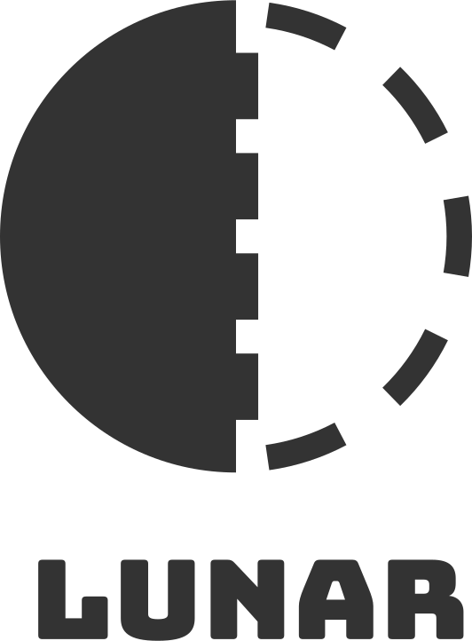

    

 

[//]: # ([![NPM Downloads][downloads-image]][downloads-url])
[//]: # (![Lunar Emblem]&#40;./assets/emblem.svg&#41;)
 

React SSR Framework

An enhanced SSR framework, offering greater flexibility than Next.js and Remix.Run, designed to build powerful front-end applications.

# Why Lunar?
* Flexible collaboration in business logic
* Intuitive division between backend API and front-end components
* Backend API abstraction (or "Concealed backend API" if you're implying security or hiding)
* Versatile user customization options
* Minimal core framework dependencies
* Loosely coupled with the framework

## Features 
* Supports Deno runtime
* File based routing
* Nested routing
* Scroll position memory
* Server-side rendering (note: this seems repetitive given the React SSR mention)
* TypeScript support
* SEO (in progress)

## Future Enhancements
* Highly customizable with both shallow and deep modifications
* Support for BUN runtime
* Support for Go and Rust runtimes 
* Multi-core optimized server-side processing
* Enhanced features for front-end applications

# Architecture
## Response Pipeline
1. 
2. 

## Server Side Script

Files ending in .server.tsx will only be executed on the server side and won't be exposed to the public.
